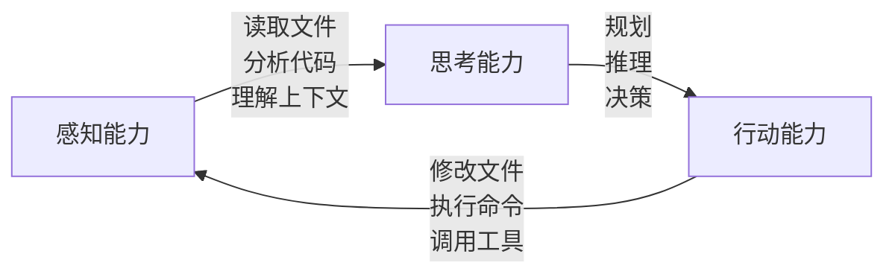
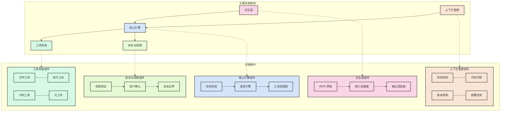
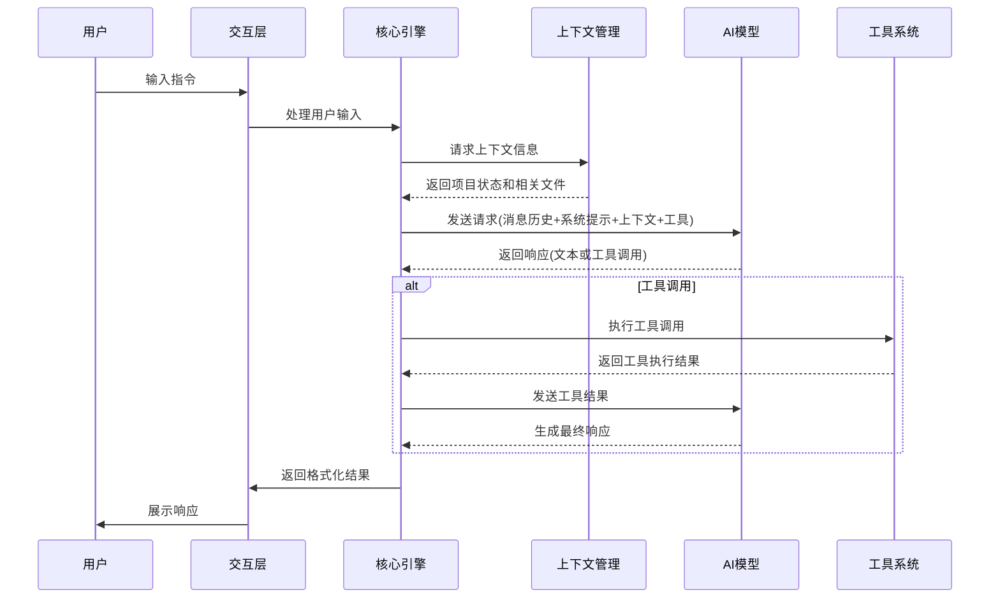

# 解密 AI 编程助手的强大能力：Claude Code 背后的技术机制（一）

> 本系列第一篇：框架、组件与执行逻辑

在 AI 迅速发展的今天，Claude Code、GitHub Copilot、Cursor 等 AI 编程助手正在改变开发者的工作方式。这些工具不仅能理解自然语言指令，还能读写代码、执行命令、分析项目结构，甚至自主解决复杂的编程问题。但你是否好奇，这些 AI 编程助手背后的技术机制是什么？它们如何实现这些看似"魔法"的功能？

本文将揭秘 AI 编程助手（Claude Code）背后的技术架构和核心机制，帮助你理解这些工具的工作原理，甚至为你构建自己的 Claude Code 提供思路。

CLaudeX 的仓库: https://github.com/DevHorizonLabs/ClaudeX

## 理解 Claude Code 的本质

Claude Code 本质上是一个由大语言模型（LLM）驱动的、能够与代码环境交互的智能系统。与普通的 AI 聊天机器人不同，Claude Code 具备"感知"和"行动"的能力：

- **感知能力**：可以读取文件、理解代码结构、分析项目上下文
- **行动能力**：可以修改文件、执行命令、调用外部工具



这种"感知-思考-行动"的循环使 Claude Code 能够像人类开发者一样与代码环境进行交互，从而实现复杂的编程任务。

## Claude Code 的核心架构

通过对 ClaudeX 开源项目的分析，我们可以将 Claude Code 的核心架构概括为以下几个部分：



### 1. 交互层

交互层是用户与 Claude Code 的接触点，通常包括：

- **REPL 界面**：提供命令行交互体验
- **输入处理器**：解析用户指令，支持多种输入模式（自然语言、命令、代码等）
- **输出渲染器**：格式化并展示 AI 响应和工具执行结果

在 ClaudeX 中，这一层主要由 `REPL.tsx` 和 `PromptInput.tsx` 等组件实现，它们负责接收用户输入并展示结果。

```typescript
// 简化的输入处理逻辑
function processUserInput(input: string, mode: InputMode): UserMessage {
  if (input.startsWith('/')) {
    return handleSlashCommand(input);
  } else if (input.startsWith('!')) {
    return handleBashCommand(input.slice(1));
  } else {
    return createUserMessage(input);
  }
}
```

### 2. 核心引擎

核心引擎是 Claude Code 的"大脑"，负责协调各个组件的工作：

- **消息系统**：管理用户输入、AI 响应和工具结果的消息流
- **查询引擎**：与 AI 模型交互，发送请求并处理响应
- **工具调度器**：协调工具的调用和结果处理

在 ClaudeX 中，`query.ts` 是核心引擎的关键组件，它实现了与 AI 模型交互的逻辑：

```typescript
// 简化的查询逻辑 - 基于实际 ClaudeX 代码改编
async function* query(
  messages: Message[],
  systemPrompt: string,
  context: Context,
  canUseTool: CanUseToolFn,
  toolUseContext: ToolUseContext,
): AsyncGenerator<Message> {
  // 1. 准备系统提示和上下文
  const formattedSystemPrompt = formatSystemPrompt(systemPrompt, context);
  
  // 2. 发送到 AI 模型并获取响应
  const assistantMessage = await getAssistantResponse(
    messages, 
    formattedSystemPrompt, 
    toolUseContext.availableTools
  );
  
  // 3. 返回助手消息
  yield assistantMessage;
  
  // 4. 提取工具调用
  const toolUses = extractToolUses(assistantMessage);
  if (!toolUses.length) {
    return; // 没有工具调用，结束流程
  }
  
  // 5. 执行工具调用
  const toolResults = [];
  
  // 确定哪些工具可以并行执行，哪些需要串行执行
  const concurrentTools = toolUses.filter(t => isReadOnlyTool(t));
  const serialTools = toolUses.filter(t => !isReadOnlyTool(t));
  
  // 并行执行只读工具
  if (concurrentTools.length > 0) {
    const concurrentResults = await Promise.all(
      concurrentTools.map(tool => executeTool(tool, canUseTool))
    );
    toolResults.push(...concurrentResults);
  }
  
  // 串行执行修改类工具
  for (const tool of serialTools) {
    const result = await executeTool(tool, canUseTool);
    toolResults.push(result);
  }
  
  // 6. 将工具结果添加到消息历史
  const updatedMessages = [...messages, assistantMessage, ...toolResults];
  
  // 7. 递归调用查询函数，继续对话
  yield* query(
    updatedMessages,
    systemPrompt,
    context,
    canUseTool,
    toolUseContext
  );
}
```

### 3. 工具系统

工具系统是 Claude Code 的"手脚"，使其能够与外部环境交互：

- **文件工具**：读取、写入、搜索文件
- **执行工具**：运行 shell 命令、执行代码
- **分析工具**：代码分析、依赖检查等
- **元工具**：复合工具，可以执行更复杂的任务

每个工具都遵循统一的接口，包括名称、描述、参数模式和执行逻辑：

```typescript
interface Tool {
  name: string;
  description: string;
  inputSchema: z.ZodType;
  execute(params: any): Promise<ToolResult>;
}
```

### 4. 上下文管理

上下文管理是 Claude Code 的"记忆"，负责收集和组织代码相关信息：

- **项目结构**：目录和文件结构
- **代码内容**：关键文件的内容
- **版本控制**：Git 历史和状态
- **配置信息**：项目配置和依赖

上下文管理的挑战在于如何在有限的 token 内提供最相关的信息：

```typescript
async function getContext(): Context {
  return {
    directoryStructure: await getDirectoryStructure(),
    gitStatus: await getGitStatus(),
    codeStyle: await getCodeStyle(),
    // 其他上下文...
  };
}
```

### 5. 安全与权限

安全与权限是 Claude Code 的"护栏"，确保工具使用的安全性：

- **权限验证**：工具执行前的权限检查
- **用户确认**：关键操作的用户确认机制
- **安全边界**：文件操作和命令执行的限制

```typescript
async function checkPermission(tool: Tool, params: any): Promise<boolean> {
  if (tool.needsPermission) {
    return await requestUserPermission(tool.name, params);
  }
  return true;
}
```

## 执行流程：从用户输入到 AI 响应

Claude Code 的执行流程是一个复杂的交互循环，下面是一个典型的执行流程：



1. **用户输入处理**：
    - 解析用户输入（自然语言、命令等）
    - 创建用户消息对象
    - 添加到消息历史

2. **上下文收集**：
    - 分析当前项目状态
    - 收集相关文件和目录信息
    - 准备系统提示和上下文

3. **AI 模型交互**：
    - 准备请求（消息历史、系统提示、上下文、可用工具）
    - 发送到 AI 模型
    - 接收和处理响应

4. **工具执行**：
    - 解析工具调用请求
    - 验证参数和权限
    - 执行工具操作
    - 收集执行结果

5. **结果处理与展示**：
    - 将工具结果返回给 AI 模型
    - 生成最终响应
    - 格式化并展示结果

整个流程形成一个闭环，允许多轮交互和复杂任务的完成。

## 深入理解：关键技术挑战

构建高效的 Claude Code 面临几个关键技术挑战：

### 1. 上下文管理的艺术

LLM 的上下文窗口有限，而代码库可能非常庞大。如何在有限的上下文中提供最相关的信息是一个关键挑战。

**解决方案**：

- **智能上下文选择**：根据用户查询动态选择相关文件
- **上下文压缩**：提取代码的关键部分，如函数签名
- **增量上下文**：按需加载更多信息

### 2. 工具使用的准确性

AI 模型需要准确理解和使用工具，这包括正确的参数传递和结果解释。

**解决方案**：

- **清晰的工具定义**：使用 JSON Schema 严格定义工具接口
- **示例和文档**：为工具提供使用示例和详细文档
- **错误处理**：优雅处理参数错误和执行失败

### 3. 安全与权限平衡

Claude Code 需要足够的权限来执行任务，但也需要防止潜在的安全风险。

**解决方案**：

- **最小权限原则**：只授予完成任务所需的最小权限
- **用户确认机制**：关键操作需要用户确认
- **安全边界**：限制文件操作范围和命令执行能力

### 4. 用户体验优化

良好的用户体验对于 Claude Code 的实用性至关重要。

**解决方案**：

- **响应速度优化**：并行工具执行、缓存常用结果
- **进度反馈**：提供清晰的执行进度和状态
- **错误恢复**：从错误中恢复并提供替代方案

## 实际应用：Claude Code 的典型场景

Claude Code 在多种编程场景中展现出强大的能力：

1. **代码理解与解释**：
    - 分析复杂代码库
    - 解释函数和模块的作用
    - 识别潜在问题和优化机会

2. **代码生成与修改**：
    - 根据自然语言描述生成代码
    - 修复 bug 和实现新功能
    - 重构和优化现有代码

3. **开发辅助**：
    - 执行构建和测试命令
    - 分析错误日志
    - 提供 API 使用建议

4. **知识管理**：
    - 创建和维护项目文档
    - 回答项目相关问题
    - 总结代码变更和提交历史

## 构建自己的 Claude Code：关键设计原则

如果你想构建自己的 Claude Code，以下是一些关键设计原则：

1. **模块化设计**：
    - 将系统分解为独立的模块
    - 定义清晰的接口和责任边界
    - 便于测试和扩展

2. **统一抽象**：
    - 为工具创建统一的接口
    - 为不同的 AI 模型提供统一的适配器
    - 标准化消息和结果格式

3. **渐进增强**：
    - 从基本功能开始
    - 逐步添加更复杂的工具和能力
    - 基于用户反馈持续优化

4. **安全第一**：
    - 默认采用最小权限
    - 提供清晰的权限控制
    - 防止潜在的安全风险

---

> 本文是 AI 编程助手技术解析系列的第一篇，后续文章将探讨：
>
> 1. 提示工程：如何设计有效的系统提示和用户指令
> 2. 核心工具清单：构建 Claude Code 的必备工具
> 3. 设计原则与最佳实践：构建高效 Claude Code 的经验总结