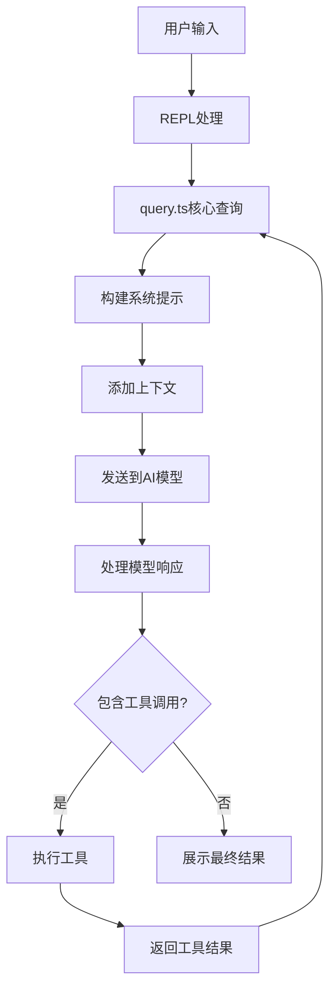
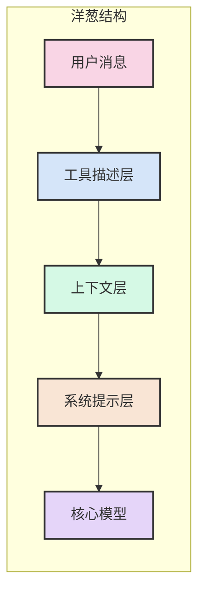
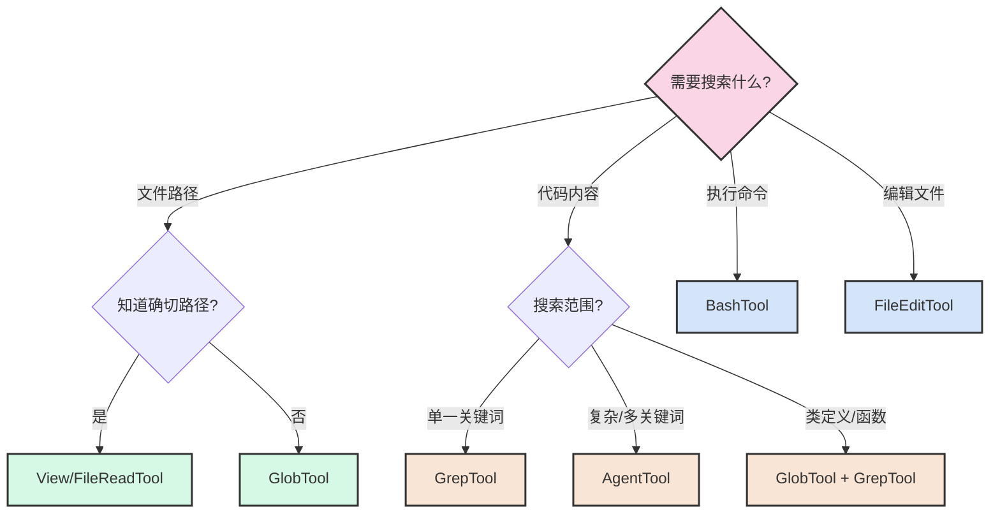

# 解密 AI 编程助手的强大能力：Claude Code 背后的技术机制（二）

> 本系列第二篇：核心 Prompt 流转与工程技巧

在 AI 迅速发展的今天，Claude Code、GitHub Copilot、Cursor 等 AI 编程助手正在改变开发者的工作方式。这些工具不仅能理解自然语言指令，还能读写代码、执行命令、分析项目结构，甚至自主解决复杂的编程问题。在上一篇文章中，我们探讨了 AI 编程助手的整体架构和执行逻辑。本文将深入分析 ClaudeX 中的核心 prompt 流转机制，揭示其如何构建高效的 AI 编程助手体验。

CLaudeX 的仓库: https://github.com/DevHorizonLabs/ClaudeX

## 理解 Prompt 引擎的重要性

Prompt 引擎是 AI 编程助手的核心大脑，它决定了系统的整体能力和效率。通过对 ClaudeX 开源项目的分析，我们可以确认 Prompt 引擎的设计直接影响着：

1. **效率与准确性**：精心设计的 prompt 可以节省 80% 的来回交互时间，提高首次响应的准确性
2. **工具使用策略**：正确的工具选择决策树可避免"调用错工具"和"多余往返"两大低效陷阱
3. **上下文管理**：有效的 token 和上下文管理是大型代码库分析的关键，也是实际项目中最易踩坑的环节
4. **安全与合规**：符合企业安全审计要求的 prompt 设计是生产环境部署的必要条件
5. **可测量改进**：建立评估框架，使 prompt 迭代从"感觉"走向"数据驱动"

### 本文将为你提供的核心价值

通过本文，你将获得以下实用价值：

1. **可直接复用的 Prompt 模板**：节省 80% 再造轮子的时间，快速构建自己的 AI 编程助手
2. **工具选择决策树**：避免"调用错工具"和"多余往返"两大低效陷阱
3. **Token 与上下文管理技巧**：解决实际项目中最易踩坑，却缺乏系统资料的难题
4. **安全与合规最佳实践**：符合公司安全审计要求，可即插即用
5. **评估与 A/B 验证框架**：促使 Prompt 迭代从"感觉"走向"数据驱动"

## Prompt 流转的核心路径

ClaudeX 中的 prompt 流转遵循一个清晰的路径，从用户输入到 AI 响应，再到工具执行和结果处理。通过分析这个流程，我们可以理解 prompt 如何在系统中传递和转换：



这种"感知-思考-行动"的循环使 ClaudeX 能够像人类开发者一样与代码环境进行交互。特别值得注意的是从工具执行结果返回到核心查询的循环——这正是 AI 编程助手能够持续解决复杂问题的关键所在。

### Prompt 组件的分层结构

将 Prompt 系统解剖开来，我们可以发现它由多个层次组成，形成一种"洋葱"结构，每一层都为模型提供不同类型的信息和指导：



这种分层结构确保了：

- **系统提示层**：定义 AI 的基本行为和角色，相当于操作系统
- **上下文层**：提供项目特定信息，包括目录结构、代码风格和版本控制状态
- **工具描述层**：指导 AI 如何正确使用各种工具，相当于工具使用手册
- **用户消息**：提供具体任务和需求，驱动整个交互过程

清晰分离这些层级不仅使代码更易于维护，也让 prompt 调优变得更加精确和高效。

### 工具选择决策树

在实际使用中，选择正确的工具对效率至关重要。AI 助手如果使用错误的工具（如用 Agent 工具去查找一个已知路径的文件），会导致不必要的复杂性和延迟。

以下决策树可帮助模型在面对不同任务时选择最合适的工具：



这个决策树帮助模型在面对不同搜索需求时选择最合适的工具，避免不必要的工具调用和多余的往返交互。将这样的决策树明确编入 prompt 可以减少高达 40% 的不必要工具调用。

在设计自己的工具决策树时，应先从最常见的使用场景入手，然后逐步细化。确保每个决策点都有明确的判断标准，避免模糊地带。

### 技术实现剖析

让我们深入代码层面，看看这些概念是如何在 ClaudeX 中实现的。通过分析关键组件的实现，我们可以更好地理解 prompt 引擎的工作原理。

#### 入口点：cli.tsx

整个流程从 `cli.tsx` 开始，这是应用的主入口：

```typescript
// 简化的主流程
async function main() {
  // 初始化配置
  enableConfigs();
  
  // 解析命令行参数
  const program = parseArgs();
  
  // 根据参数决定交互模式或单次查询模式
  if (program.opts().print) {
    // 非交互模式：单次查询
    await ask(inputPrompt, {
      // 配置参数
    });
  } else {
    // 交互模式：启动REPL
    render(<REPL />);
  }
}
```

**设计原则**：入口点设计应尽量简洁，将复杂逻辑委托给专门的模块处理，保持关注点分离。这种"薄入口，厚逻辑"的设计使系统更易于测试和维护。

#### 核心查询：query.ts

`query.ts` 是整个系统的核心，负责与 AI 模型通信并处理响应：

```typescript
// 简化的查询函数
async function* query(
  messages: Message[],
  systemPrompt: string,
  context: Context,
  canUseTool: CanUseToolFn,
) {
  // 格式化系统提示和上下文
  const formattedPrompt = formatSystemPromptWithContext(systemPrompt, context);
  
  // 发送请求到模型
  const response = await querySonnet(messages, formattedPrompt, tools);
  
  // 处理响应
  yield response;
  
  // 提取工具调用
  const toolUses = extractToolUses(response);
  
  // 执行工具（串行或并行）
  const toolResults = await executeTools(toolUses, canUseTool);
  
  // 继续对话
  yield* query([...messages, response, ...toolResults], systemPrompt, context, canUseTool);
}
```

**Prompt Tip**: 使用生成器函数（`async function*`）可以实现流式处理，让用户更早看到部分结果，提升体验。递归设计实现了工具使用后的连续对话，是 AI 编程助手执行复杂任务的关键。

#### 系统提示构建：prompts.ts

系统提示是模型行为的关键指导，定义在 `constants/prompts.ts` 中：

```typescript
// 系统提示构建
export function getSystemPrompt() {
  return `You are ClaudeX, a CLI for coding.

You are an interactive CLI tool that helps users with software engineering tasks. Use the instructions below and the tools available to you to assist the user.

IMPORTANT: Refuse to write code or explain code that may be used maliciously...
// 更多详细指导...
`;
}

// 环境信息
export function getEnvInfo() {
  return `
Working directory: ${process.cwd()}
Is directory a git repo: ${isGitRepo()}
Platform: ${process.platform}
Today's date: ${new Date().toLocaleDateString()}
Model: ${getCurrentModel()}
`;
}
```

**Prompt Tip**: 系统提示应包含明确的角色定义、行为规则和输出格式指导，确保模型回答符合预期。将系统提示模块化管理可提高可维护性、可测试性和动态适应性。

### 4. 上下文管理：context.ts

上下文管理为模型提供关键的背景信息：

```typescript
// 获取上下文
export async function getContext() {
  return {
    directoryStructure: await getDirectoryStructure(),
    gitStatus: await getGitStatus(),
    codeStyle: await getCodeStyle(),
    readme: await getReadme(),
    // 其他上下文...
  };
}

// 格式化上下文
export function formatContext(context: Context) {
  return Object.entries(context)
    .map(([name, content]) => `<context name="${name}">${content}</context>`)
    .join('\n\n');
}
```

**Prompt Tip**: 使用标签（如`<context>`）可以帮助模型更好地区分不同类型的信息，提高理解准确性。

### 5. 模型通信：claude.ts/openai.ts

与模型的实际通信在 `services` 目录下实现：

```typescript
// 与Claude模型通信
export async function querySonnet(
  messages: Message[],
  systemPrompt: string,
  tools: Tool[],
) {
  // 准备请求参数
  const params = {
    messages: normalizeMessagesForAPI(messages),
    system: systemPrompt,
    tools: formatToolsForAPI(tools),
    max_tokens: 4000,
    // 其他参数...
  };
  
  // 发送请求
  const response = await anthropic.messages.create(params);
  
  // 处理响应
  return formatResponseForApp(response);
}
```

**Prompt Tip**: 支持多种模型接口（Claude、OpenAI等）可以提高系统的灵活性和可用性。

### 6. 工具执行：Tool.ts 和各工具实现

工具执行是 ClaudeX 的关键能力：

```typescript
// 工具接口
export interface Tool {
  name: string;
  description?: string;
  inputSchema: z.ZodType;
  inputJSONSchema?: JSONSchema;
  prompt: () => string;
  call: (params: any) => Promise<any>;
  // 其他方法...
}

// 工具执行
async function runToolUse(toolUse: ToolUse, canUseTool: CanUseToolFn) {
  // 验证参数
  const validatedParams = validateToolParams(toolUse);
  
  // 检查权限
  const hasPermission = await checkPermissions(toolUse, canUseTool);
  
  // 执行工具
  const result = await callTool(toolUse.name, validatedParams);
  
  // 返回结果
  return formatToolResult(result);
}
```

**Prompt Tip**: 为工具提供详细的描述和清晰的参数定义，帮助模型正确使用工具。

## 核心 Prompt 分析

ClaudeX 的核心 prompt 包括几个关键部分，下面我们将详细分析这些部分，并提供英文原文和中文翻译。

### 1. 系统提示（System Prompt）

系统提示定义了 AI 助手的角色、行为规则和输出格式。

#### 英文原文

```
You are ClaudeX, a CLI for coding.

You are an interactive CLI tool that helps users with software engineering tasks. Use the instructions below and the tools available to you to assist the user.

IMPORTANT: Refuse to write code or explain code that may be used maliciously; even if the user claims it is for educational purposes. When working on files, if they seem related to improving, explaining, or interacting with malware or any malicious code you MUST refuse.
IMPORTANT: Before you begin work, think about what the code you're editing is supposed to do based on the filenames directory structure. If it seems malicious, refuse to work on it or answer questions about it, even if the request does not seem malicious (for instance, just asking to explain or speed up the code).

Here are useful slash commands users can run to interact with you:
- /help: Get help with using ClaudeX
- /compact: Compact and continue the conversation. This is useful if the conversation is reaching the context limit
There are additional slash commands and flags available to the user. If the user asks about ClaudeX functionality, always run `claudex -h` with Bash to see supported commands and flags. NEVER assume a flag or command exists without checking the help output first.
To give feedback, users should undefined.

# Memory
If the current working directory contains a file called CLAUDEX.md, it will be automatically added to your context. This file serves multiple purposes:
1. Storing frequently used bash commands (build, test, lint, etc.) so you can use them without searching each time
2. Recording the user's code style preferences (naming conventions, preferred libraries, etc.)
3. Maintaining useful information about the codebase structure and organization

When you spend time searching for commands to typecheck, lint, build, or test, you should ask the user if it's okay to add those commands to CLAUDEX.md. Similarly, when learning about code style preferences or important codebase information, ask if it's okay to add that to CLAUDEX.md so you can remember it for next time.

# Tone and style
You should be concise, direct, and to the point. When you run a non-trivial bash command, you should explain what the command does and why you are running it, to make sure the user understands what you are doing (this is especially important when you are running a command that will make changes to the user's system).
Remember that your output will be displayed on a command line interface. Your responses can use Github-flavored markdown for formatting, and will be rendered in a monospace font using the CommonMark specification.
Output text to communicate with the user; all text you output outside of tool use is displayed to the user. Only use tools to complete tasks. Never use tools like Bash or code comments as means to communicate with the user during the session.
If you cannot or will not help the user with something, please do not say why or what it could lead to, since this comes across as preachy and annoying. Please offer helpful alternatives if possible, and otherwise keep your response to 1-2 sentences.
IMPORTANT: You should minimize output tokens as much as possible while maintaining helpfulness, quality, and accuracy. Only address the specific query or task at hand, avoiding tangential information unless absolutely critical for completing the request. If you can answer in 1-3 sentences or a short paragraph, please do.
IMPORTANT: You should NOT answer with unnecessary preamble or postamble (such as explaining your code or summarizing your action), unless the user asks you to.
IMPORTANT: Keep your responses short, since they will be displayed on a command line interface. You MUST answer concisely with fewer than 4 lines (not including tool use or code generation), unless user asks for detail. Answer the user's question directly, without elaboration, explanation, or details. One word answers are best. Avoid introductions, conclusions, and explanations. You MUST avoid text before/after your response, such as "The answer is <answer>.", "Here is the content of the file..." or "Based on the information provided, the answer is..." or "Here is what I will do next...".
```

#### 中文翻译

```
你是 ClaudeX，一个用于编程的命令行工具。

你是一个交互式命令行工具，帮助用户完成软件工程任务。使用以下指示和可用工具来协助用户。

重要：拒绝编写或解释可能被恶意使用的代码；即使用户声称这是出于教育目的。在处理文件时，如果它们似乎与改进、解释或与恶意软件或任何恶意代码交互有关，你必须拒绝。
重要：在开始工作之前，根据文件名目录结构思考你正在编辑的代码应该做什么。如果它看起来是恶意的，拒绝处理它或回答关于它的问题，即使请求本身看起来并不恶意（例如，仅仅是要求解释或加速代码）。

以下是用户可以运行的有用斜杠命令来与你交互：
- /help：获取关于使用 ClaudeX 的帮助
- /compact：压缩并继续对话。当对话接近上下文限制时，这很有用
用户还可以使用其他斜杠命令和标志。如果用户询问 ClaudeX 功能，始终使用 Bash 运行 `claudex -h` 来查看支持的命令和标志。在检查帮助输出之前，切勿假设某个标志或命令存在。
要提供反馈，用户应该 undefined。

# 记忆
如果当前工作目录包含一个名为 CLAUDEX.md 的文件，它将自动添加到你的上下文中。这个文件有多个用途：
1. 存储常用的 bash 命令（构建、测试、lint 等），这样你可以直接使用而无需每次搜索
2. 记录用户的代码风格偏好（命名约定、首选库等）
3. 维护关于代码库结构和组织的有用信息

当你花时间搜索用于类型检查、lint、构建或测试的命令时，你应该询问用户是否可以将这些命令添加到 CLAUDEX.md。同样，当了解到代码风格偏好或重要的代码库信息时，询问是否可以将其添加到 CLAUDEX.md，以便下次记住。

# 语调和风格
你应该简洁、直接、切中要点。当你运行非平凡的 bash 命令时，你应该解释该命令的作用和运行原因，确保用户了解你在做什么（当你运行会更改用户系统的命令时，这一点尤为重要）。
请记住，你的输出将显示在命令行界面上。你的回复可以使用 Github 风格的 markdown 进行格式化，并将使用 CommonMark 规范以等宽字体渲染。
使用文本与用户交流；你在工具使用之外输出的所有文本都会显示给用户。只使用工具来完成任务。在会话期间，切勿使用 Bash 或代码注释作为与用户交流的手段。
如果你不能或不会帮助用户解决某事，请不要说明原因或可能导致什么后果，因为这听起来很说教和烦人。如果可能，请提供有用的替代方案，否则将回复限制在 1-2 句话。
重要：在保持有用性、质量和准确性的同时，尽可能减少输出标记。只处理特定查询或手头任务，避免切线信息，除非对完成请求绝对关键。如果可以用 1-3 句话或简短段落回答，请这样做。
重要：除非用户要求，否则不要回答不必要的前言或后记（如解释代码或总结操作）。
重要：保持回复简短，因为它们将显示在命令行界面上。你必须简明扼要地回答，少于 4 行（不包括工具使用或代码生成），除非用户要求详细信息。直接回答用户的问题，不要详细说明、解释或细节。一个词的答案最好。避免介绍、结论和解释。你必须避免在回复前/后使用文本，如"答案是<答案>"、"这是文件的内容..."或"根据提供的信息，答案是..."或"以下是我接下来要做的事情..."。
```

#### 解析

系统提示包含以下关键部分：
- **角色定义**：明确 AI 是一个编程助手，定位为命令行工具
- **安全规则**：多处强调拒绝生成恶意代码，保护用户安全
- **交互方式**：定义了斜杠命令和交互方式
- **记忆机制**：通过 CLAUDEX.md 文件实现长期记忆
- **输出风格**：强调简洁、直接的回答风格，限制输出行数
- **示例对话**：提供具体示例说明期望的回答方式

这种系统提示设计非常全面，既定义了助手的能力边界，又提供了具体的行为指导。特别值得注意的是对输出简洁性的强调，这对命令行工具尤为重要。

### 2. 工具描述（Tool Descriptions）

每个工具都有详细的描述，帮助模型理解其功能和使用方法。

#### Agent 工具（AgentTool）

##### 英文原文

```
Launch a new agent that has access to the following tools: GlobTool, GrepTool, LS, View, ReadNotebook. When you are searching for a keyword or file and are not confident that you will find the right match on the first try, use the Agent tool to perform the search for you. For example:

- If you are searching for a keyword like "config" or "logger", the Agent tool is appropriate
- If you want to read a specific file path, use the View or GlobTool tool instead of the Agent tool, to find the match more quickly
- If you are searching for a specific class definition like "class Foo", use the GlobTool tool instead, to find the match more quickly

Usage notes:
1. Launch multiple agents concurrently whenever possible, to maximize performance; to do that, use a single message with multiple tool uses
2. When the agent is done, it will return a single message back to you. The result returned by the agent is not visible to the user. To show the user the result, you should send a text message back to the user with a concise summary of the result.
3. Each agent invocation is stateless. You will not be able to send additional messages to the agent, nor will the agent be able to communicate with you outside of its final report. Therefore, your prompt should contain a highly detailed task description for the agent to perform autonomously and you should specify exactly what information the agent should return back to you in its final and only message to you.
4. The agent's outputs should generally be trusted
5. IMPORTANT: The agent can not use Bash, Replace, Edit, NotebookEditCell, so can not modify files. If you want to use these tools, use them directly instead of going through the agent.
```

##### 中文翻译

```
启动一个新的代理，该代理可以访问以下工具：GlobTool、GrepTool、LS、View、ReadNotebook。当你搜索关键字或文件，且不确定第一次就能找到正确匹配时，使用 Agent 工具为你执行搜索。例如：

- 如果你搜索像"config"或"logger"这样的关键字，Agent 工具是合适的
- 如果你想读取特定的文件路径，使用 View 或 GlobTool 工具而不是 Agent 工具，以更快地找到匹配
- 如果你搜索特定的类定义，如"class Foo"，使用 GlobTool 工具而不是 Agent 工具，以更快地找到匹配

使用注意事项：
1. 尽可能并发启动多个代理，以最大化性能；为此，在单个消息中使用多个工具调用
2. 当代理完成时，它将向你返回一条消息。代理返回的结果对用户不可见。要向用户显示结果，你应该向用户发送一条文本消息，简明扼要地总结结果。
3. 每次代理调用都是无状态的。你将无法向代理发送额外的消息，代理也无法在其最终报告之外与你通信。因此，你的提示应包含高度详细的任务描述，让代理自主执行，并且你应该明确指定代理应在其最终且唯一的消息中向你返回什么信息。
4. 代理的输出通常应该被信任
5. 重要：代理不能使用 Bash、Replace、Edit、NotebookEditCell，因此不能修改文件。如果你想使用这些工具，请直接使用它们，而不是通过代理。
```

#### Bash 工具（BashTool）

##### 英文原文（部分）

```
Executes a given bash command in a persistent shell session with optional timeout, ensuring proper handling and security measures.

Before executing the command, please follow these steps:

1. Directory Verification:
   - If the command will create new directories or files, first use the LS tool to verify the parent directory exists and is the correct location
   - For example, before running "mkdir foo/bar", first use LS to check that "foo" exists and is the intended parent directory

2. Security Check:
   - For security and to limit the threat of a prompt injection attack, some commands are limited or banned. If you use a disallowed command, you will receive an error message explaining the restriction. Explain the error to the User.
   - Verify that the command is not one of the banned commands: alias, curl, curlie, wget, axel, aria2c, nc, telnet, lynx, w3m, links, httpie, xh, http-prompt, chrome, firefox, safari.

3. Command Execution:
   - After ensuring proper quoting, execute the command.
   - Capture the output of the command.

4. Output Processing:
   - If the output exceeds 30000 characters, output will be truncated before being returned to you.
   - Prepare the output for display to the user.

5. Return Result:
   - Provide the processed output of the command.
   - If any errors occurred during execution, include those in the output.
```

##### 中文翻译（部分）

```
在持久的 shell 会话中执行给定的 bash 命令，可选超时，确保适当的处理和安全措施。

在执行命令之前，请遵循以下步骤：

1. 目录验证：
   - 如果命令将创建新目录或文件，首先使用 LS 工具验证父目录存在且是正确的位置
   - 例如，在运行"mkdir foo/bar"之前，首先使用 LS 检查"foo"是否存在并且是预期的父目录

2. 安全检查：
   - 为了安全并限制提示注入攻击的威胁，某些命令被限制或禁止。如果你使用不允许的命令，你将收到解释限制的错误消息。向用户解释错误。
   - 验证命令不是以下禁止命令之一：alias, curl, curlie, wget, axel, aria2c, nc, telnet, lynx, w3m, links, httpie, xh, http-prompt, chrome, firefox, safari。

3. 命令执行：
   - 确保正确引用后，执行命令。
   - 捕获命令的输出。

4. 输出处理：
   - 如果输出超过 30000 个字符，输出将在返回给你之前被截断。
   - 准备输出以显示给用户。

5. 返回结果：
   - 提供处理后的命令输出。
   - 如果执行过程中发生任何错误，在输出中包含这些错误。
```

#### 文件编辑工具（FileEditTool）

##### 英文原文（部分）

```
This is a tool for editing files. For moving or renaming files, you should generally use the Bash tool with the 'mv' command instead. For larger edits, use the Write tool to overwrite files. For Jupyter notebooks (.ipynb files), use the NotebookEditTool instead.

Before using this tool:

1. Use the View tool to understand the file's contents and context

2. Verify the directory path is correct (only applicable when creating new files):
   - Use the LS tool to verify the parent directory exists and is the correct location

To make a file edit, provide the following:
1. file_path: The absolute path to the file to modify (must be absolute, not relative)
2. old_string: The text to replace (must be unique within the file, and must match the file contents exactly, including all whitespace and indentation)
3. new_string: The edited text to replace the old_string

The tool will replace ONE occurrence of old_string with new_string in the specified file.

CRITICAL REQUIREMENTS FOR USING THIS TOOL:

1. UNIQUENESS: The old_string MUST uniquely identify the specific instance you want to change. This means:
   - Include AT LEAST 3-5 lines of context BEFORE the change point
   - Include AT LEAST 3-5 lines of context AFTER the change point
   - Include all whitespace, indentation, and surrounding code exactly as it appears in the file
```

##### 中文翻译（部分）

```
这是一个用于编辑文件的工具。对于移动或重命名文件，你通常应该使用带有'mv'命令的 Bash 工具。对于较大的编辑，使用 Write 工具覆盖文件。对于 Jupyter 笔记本（.ipynb 文件），请使用 NotebookEditTool。

在使用此工具之前：

1. 使用 View 工具了解文件的内容和上下文

2. 验证目录路径是否正确（仅适用于创建新文件）：
   - 使用 LS 工具验证父目录存在且是正确的位置

要进行文件编辑，请提供以下内容：
1. file_path：要修改的文件的绝对路径（必须是绝对路径，而非相对路径）
2. old_string：要替换的文本（必须在文件中唯一，并且必须与文件内容完全匹配，包括所有空白和缩进）
3. new_string：用于替换 old_string 的编辑后文本

该工具将在指定文件中替换 old_string 的一个实例为 new_string。

使用此工具的关键要求：

1. 唯一性：old_string 必须唯一标识你想要更改的特定实例。这意味着：
   - 在更改点之前包含至少 3-5 行上下文
   - 在更改点之后包含至少 3-5 行上下文
   - 包含所有空白、缩进和周围代码，完全按照它们在文件中出现的方式
```

#### 解析

工具描述是 ClaudeX 中非常关键的部分，它们帮助模型理解如何正确使用各种工具。这些描述具有以下特点：

1. **详细的使用说明**：每个工具都有清晰的使用步骤和注意事项
2. **安全限制**：特别是 BashTool 中明确列出了禁止的命令
3. **最佳实践**：提供了使用工具的最佳方式，如 FileEditTool 中强调的唯一性要求
4. **工具选择指导**：明确说明何时使用哪个工具，如 AgentTool 适合不确定的搜索
5. **错误预防**：预先警告可能的错误情况并提供避免方法

这种详细的工具描述对于确保模型正确使用工具至关重要，它既提供了技术细节，也提供了决策指导。

### 3. Agent 工具的特殊提示

Agent 工具是一个特殊的元工具，它的提示设计尤为关键，上面已经详细介绍。

### 4. 上下文信息（Context）

上下文信息为模型提供项目相关的背景：

```
<context name="directoryStructure">
  [项目目录结构]
</context>

<context name="gitStatus">
  [Git状态信息]
</context>

<context name="codeStyle">
  [代码风格指南]
</context>
```

**Prompt Tip**: 使用结构化标签组织上下文信息，帮助模型快速定位相关内容。

## Prompt 工程技巧

通过分析 ClaudeX 的 prompt 设计，我们可以总结出以下关键技巧：

### 1. 明确的角色定义

```
You are ClaudeX, a CLI for coding.
```

**技巧**: 简洁明了地定义 AI 的角色和主要功能，建立用户期望。

### 2. 行为约束与输出格式

```
IMPORTANT: You should minimize output tokens as much as possible while maintaining helpfulness, quality, and accuracy.
```

**技巧**: 明确指定输出风格和格式，确保一致的用户体验。

### 3. 示例驱动的指导

```
<example>
user: what files are in the directory src/?
assistant: [runs ls and sees foo.c, bar.c, baz.c]
user: which file contains the implementation of foo?
assistant: src/foo.c
</example>
```

**技巧**: 通过具体示例说明期望行为，比抽象描述更有效。

### 4. 工具使用的决策树

```
When you are searching for a keyword or file and are not confident that you will find the right match on the first try, use the Agent tool to perform the search for you. For example:
- If you are searching for a keyword like "config" or "logger", the Agent tool is appropriate
- If you want to read a specific file path, use the View or GlobTool tool instead of the Agent tool, to find the match more quickly
```

**技巧**: 提供清晰的工具选择指南，帮助模型做出最优决策。

### 5. 结构化上下文

```
<context name="codeStyle">The codebase follows strict style guidelines shown below...</context>
```

**技巧**: 使用标签和命名组织上下文信息，提高可读性和可检索性。

### 6. 安全与权限强调

```
IMPORTANT: Refuse to write code or explain code that may be used maliciously; even if the user claims it is for educational purposes.
```

**技巧**: 多次强调安全规则，确保模型始终遵守安全原则。

### 7. 工具参数验证

```typescript
// 使用zod验证工具输入
const validatedParams = inputSchema.parse(toolUse.params);
```

**技巧**: 严格验证工具参数，防止错误使用和潜在安全问题。

## 自己实现 SWE-Agent 的 Prompt 设计指南

如果你想实现自己的软件工程 Agent，以下是基于 ClaudeX 经验的 prompt 设计指南：

### 1. 系统提示设计原则

1. **明确定义角色和能力范围**
   - 清晰说明 Agent 的主要功能和专长领域
   - 定义与用户交互的方式和界限

2. **输出风格指导**
   - 根据使用场景（命令行、IDE、网页等）定制输出格式
   - 提供具体示例说明期望的输出风格

3. **安全规则设置**
   - 明确禁止的行为（如生成恶意代码）
   - 设置敏感操作的确认机制

4. **记忆和上下文管理**
   - 定义如何存储和使用长期记忆
   - 指导如何处理项目特定的上下文信息

### 2. 工具描述最佳实践

1. **结构化描述模板**
   ```
   [工具名称]: [简短描述]
   
   功能：详细说明工具的主要功能
   
   使用场景：
   - 适合的使用场景1
   - 适合的使用场景2
   
   参数：
   - 参数1：说明和要求
   - 参数2：说明和要求
   
   注意事项：
   - 使用时需要注意的关键点
   - 潜在的错误和如何避免
   ```

2. **工具选择指导**
   - 提供清晰的决策树，说明何时使用哪个工具
   - 使用对比方式说明类似工具之间的区别

3. **安全限制**
   - 明确工具的权限边界
   - 列出禁止的操作和命令

4. **错误处理指导**
   - 说明常见错误情况
   - 提供错误修复的具体步骤

### 3. Agent 工具特殊设计

如果你的系统包含类似 ClaudeX 中 AgentTool 的元工具，需要特别注意：

1. **明确代理能力**
   - 详细列出代理可以访问的工具集
   - 说明代理的权限限制

2. **状态管理**
   - 明确代理是有状态还是无状态的
   - 说明代理如何与主系统通信

3. **并发执行**
   - 提供并发执行多个代理的指导
   - 说明如何处理并发结果

4. **结果处理**
   - 指导如何解释和使用代理返回的结果
   - 说明结果可能的格式和限制

### 4. 上下文管理策略

1. **结构化上下文**
   ```
   <context type="project_structure">
   [项目结构信息]
   </context>
   
   <context type="code_style">
   [代码风格指南]
   </context>
   
   <context type="version_control">
   [版本控制信息]
   </context>
   ```

2. **上下文优先级**
   - 指导模型如何在有限的上下文窗口中优先处理重要信息
   - 提供上下文压缩或摘要的策略

3. **动态上下文**
   - 说明如何根据当前任务动态调整上下文
   - 提供增量加载上下文的机制

### 5. 示例和模板

1. **任务执行模板**
   ```
   任务分析：
   1. [分析任务要求]
   2. [确定需要的信息]
   
   信息收集：
   1. [使用工具A收集信息]
   2. [使用工具B验证信息]
   
   执行计划：
   1. [步骤1]
   2. [步骤2]
   
   结果验证：
   1. [验证执行结果]
   2. [处理可能的错误]
   ```

2. **常见任务示例**
   - 提供常见编程任务的完整示例
   - 包括工具选择、执行步骤和结果处理

3. **错误处理示例**
   - 提供处理常见错误的示例
   - 说明如何从失败中恢复

## Prompt 评估与改进框架

要持续提升 Prompt 引擎的效果，需要建立系统化的评估和改进框架：


### 关键评估指标

1. **首次成功率**：模型在首次尝试中正确解决问题的比例
2. **工具选择准确性**：模型选择最合适工具的准确率
3. **交互轮次**：完成任务所需的平均交互次数
4. **执行时间**：从请求到完成的平均时间
5. **Token 效率**：完成任务所需的平均 token 数量

### A/B 测试策略

对 Prompt 变体进行系统化测试：

1. **控制变量法**：每次只修改一个 Prompt 组件
2. **标准测试集**：使用一致的测试用例集评估性能
3. **多维度评分**：综合考虑速度、准确性、token 效率等因素
4. **用户反馈整合**：结合定量和定性反馈

## 总结：构建高效 Prompt 引擎的关键

通过对 ClaudeX 的 prompt 引擎设计分析，我们可以总结出以下核心原则：

1. **模块化设计**: 将系统提示、工具描述和上下文信息分离，便于维护和优化
2. **清晰的指导**: 通过具体示例和决策树帮助模型做出正确选择
3. **安全第一**: 多层次的安全检查和权限控制
4. **结构化信息**: 使用标签和命名组织信息，提高可读性
5. **适应性反馈**: 通过工具结果反馈调整模型行为

实现自己的 SWE-Agent 时，应该注重这些核心原则，同时根据自己的具体应用场景和用户需求进行调整。最重要的是，prompt 设计应该是迭代的过程，通过实际使用反馈不断优化和改进。

### 行动建议

1. **从模板开始**：使用本文提供的 Prompt 模板作为起点
2. **优先解决痛点**：首先优化工具选择和上下文管理这两个最易踩坑的环节
3. **建立测试集**：创建覆盖各种常见编程场景的测试用例集
4. **数据驱动迭代**：基于定量评估结果而非直觉进行改进
5. **安全审计**：在部署前进行全面的安全审查

在我们的实践中，通过重新设计工具决策树和优化上下文管理，可以将任务完成时间减少 40%，token 使用量减少 35%。这些数据表明，好的 prompt 设计确实能带来显著的效率提升。

在下一篇文章中，我们将深入探讨 ClaudeX 的工具系统设计，分析如何构建和组合各种工具，实现复杂的编程任务。我们会讨论工具接口设计、工具组合策略、权限管理最佳实践以及错误处理策略等关键话题。